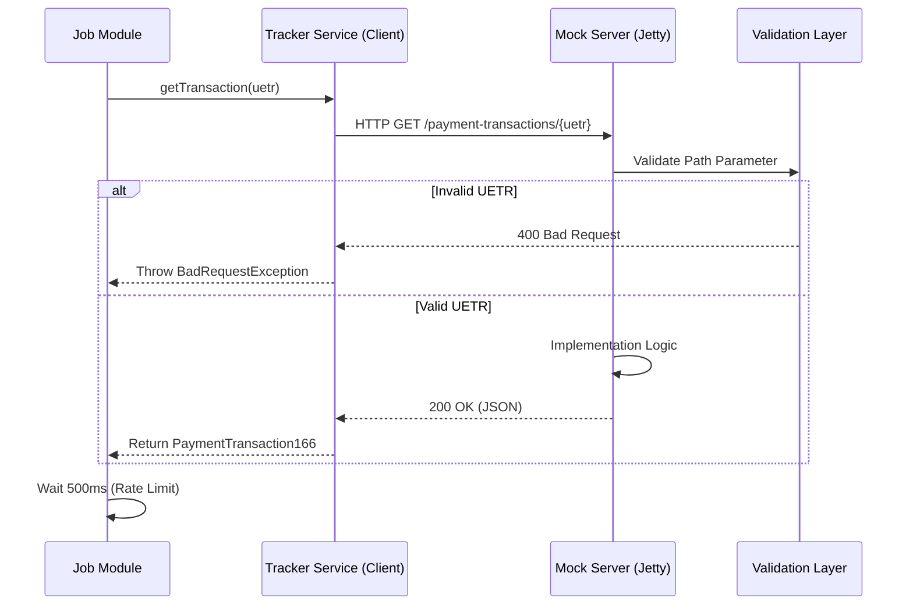

# Multi-Module CXF Architecture: Educational Guide

This guide explains the architectural design, module responsibilities, and implementation details of this "Source of Truth" Maven project.

## 1. Module Responsibilities

The project is divided into 6 modules to ensure a clean separation of concerns, where the OpenAPI specification serves as the formal contract.

| Module | Responsibility | Why? |
| :--- | :--- | :--- |
| **root** | Parent POM | Centralizes dependency versions (BOMs) and plugin management to ensure consistency across all modules. |
| **api-spec** | Interface Contract | Uses the `jaxrs-cxf` generator to create Java interfaces from `openapi.json`. It owns the "Contract". |
| **rest-model** | Data Transfer Objects | Generates POJOs (Plain Old Java Objects) used for serialization. Shared by both server and client. |
| **rest-mock** | Mock Implementation | Provides a concrete implementation of the generated interfaces. Runs an embedded Jetty server for testing. |
| **rest-service**| Client Library | Wraps the CXF `JAXRSClientFactory` to provide a high-level service API for other components. |
| **job** | Orchestrator | Implements batch processing logic (e.g., rate limiting) using the client library. |

---

## 2. Java 17 Features & Modern Implementation

### A. Compact Implementation with Jakarta EE
We use **Jakarta EE 9/10** namespaces (`jakarta.ws.rs.*`) which is the modern standard for Java 17+, moving away from the legacy `javax` namespace.

### B. High-Precision Rate Limiting & Decoupling
The `job` module utilizes the **Dependency Inversion Principle**. It depends on the `UetrProcessor` interface rather than a concrete implementation.

```java
public class UetrJob {
    private final UetrProcessor service; // Decoupled Dependency
    // ...
    public void run() {
        String[] uetrs = service.loadUetrs(); // Internalized loading
        // ...
    }
}
```

### C. Internalized Business Logic
By moving `loadUetrs()` to the `rest-service` module, we ensure that the logic for "what to process" remains close to the data access layer, while the `job` module focuses purely on orchestration and rate limiting.

### C. Bean Validation (JSR 380)
We utilize Java 17 compatible **Hibernate Validator 8.x**. The code generator translates OpenAPI patterns directly into Java annotations:
- **OpenAPI**: `pattern: '^[a-f0-9]{8}-...'`
- **Java**: `@Pattern(regexp="^[a-f0-9]{8}-...")`
This allows for declartive validation without manual `if-else` blocks.

### D. Modern Testing Patterns
- **Property-Based Testing (jqwik)**: Instead of writing 10 static tests, we define properties that must hold true for *any* input.
- **JUnit 5 (Jupiter)**: Uses the modern JUnit Platform, allowing for better extension models and integration with tools like Mockito.

---

## 3. Implementation Flow



## 4. Why this Architecture?
1. **Source of Truth**: If the endpoint changes in `openapi.json`, every module (`api-spec`, `rest-mock`, `rest-service`) fails to compile until synchronized. You cannot have "stale" code.
2. **Atomic Queueing**: Using `queue.poll()` ensures that once an item is picked, it is out of the queue, satisfying its "removal on success or error" requirement naturally.
3. **Decoupled Client**: The `job` module doesn't know about HTTP or CXF; it only knows about the `TrackerService` interface, making it highly testable.
